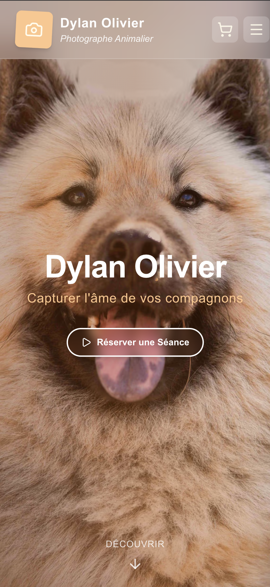
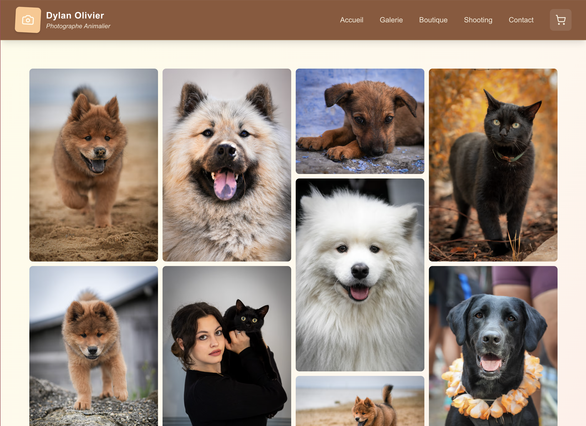
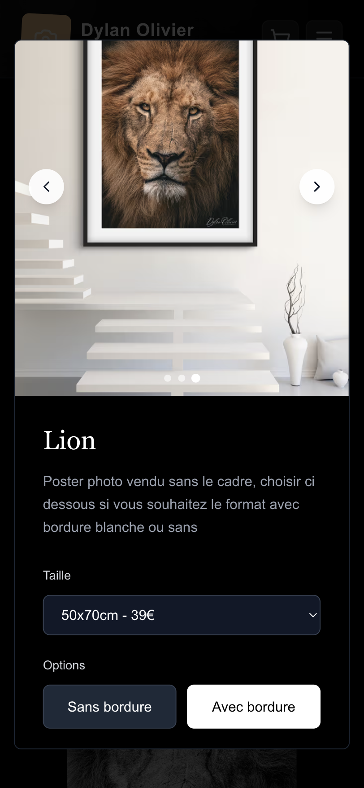
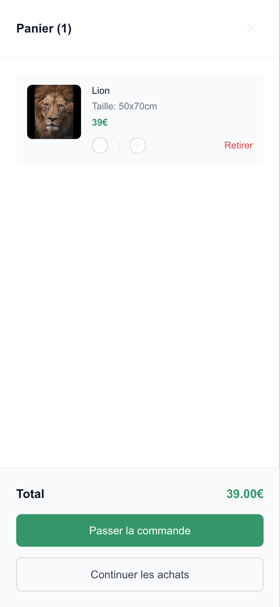
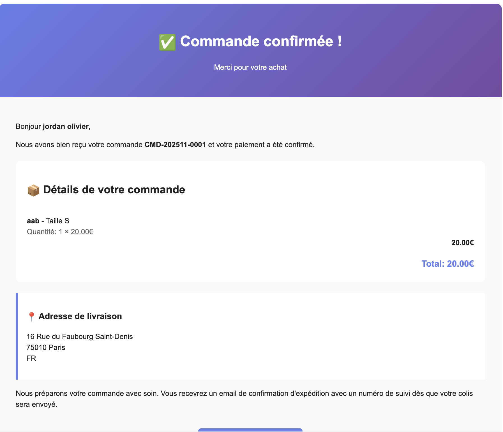
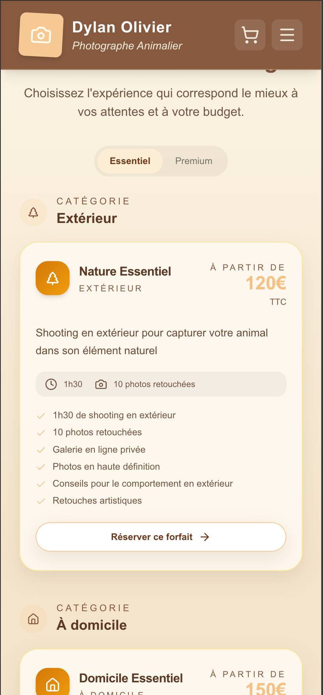
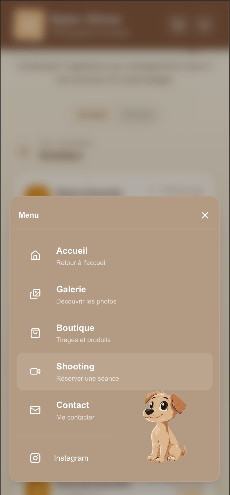
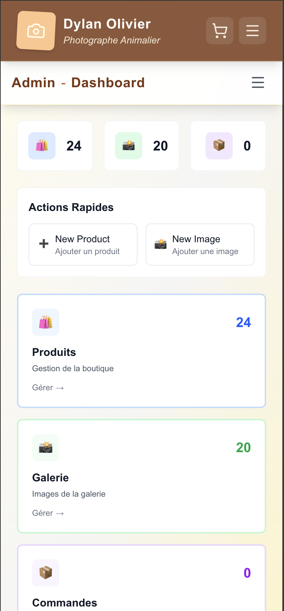
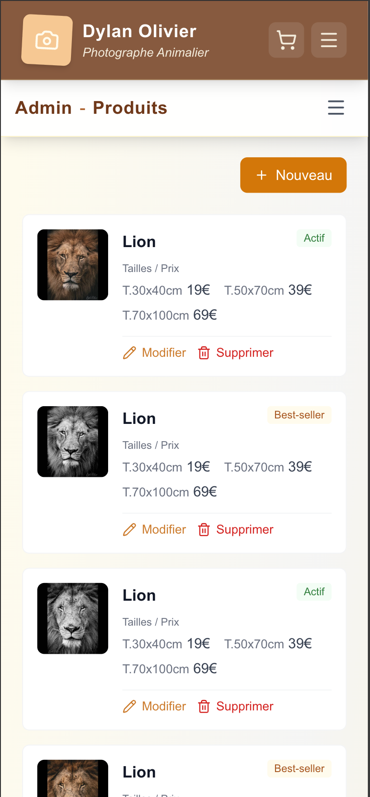
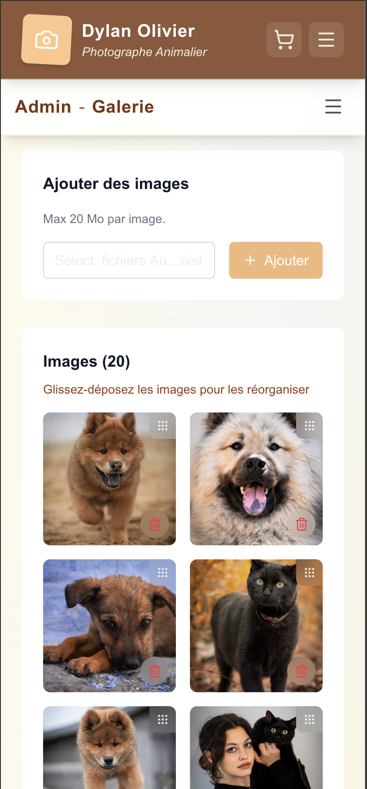

# Animaux Portfolio — Site vitrine & e-commerce

> Site vitrine et boutique en ligne pour Dylan Olivier, photographe animalier.
> Projet réalisé dans le cadre du module **Web Services** — M2 Ynov.

---

## Aperçu du site

### Page d'accueil




### Galerie photo



### Boutique ( Changement d'ambiance car on change d'univers)




### Panier & Paiement Stripe





### Shooting (réservation)



### Menu



### Back-office admin







---

## Stack technique

| Couche | Technologie | Version |
|---|---|---|
| **Frontend** | Next.js
| **UI** | React + Tailwind CSS + Framer Motion 
| **Backend / API** | Hono.js 
| **Base de données** | MongoDB + Mongoose
| **Paiement** | Stripe Checkout
| **Email** | Brevo
| **Auth** | JWT + cookies HttpOnly
| **Validation** | Zod |
| **Tests** | Vitest
| **Déploiement** | VPS + PM2
| **Langage** | TypeScript 

---

## Architecture du projet

```
webservices-ynov/
│
├── animaux-portfolio/            # Frontend Next.js
│   ├── src/
│   │   ├── app/                  # Pages (App Router)
│   │   │   ├── page.tsx                    # Accueil
│   │   │   ├── shooting/page.tsx           # Réservation shooting
│   │   │   ├── galerie/page.tsx            # Galerie photo
│   │   │   ├── boutique/page.tsx           # Boutique
│   │   │   ├── boutique-safari/page.tsx    # Boutique Safari
│   │   │   ├── contact/page.tsx            # Contact
│   │   │   ├── checkout/success/page.tsx   # Succès paiement
│   │   │   └── admin/                      # Back-office
│   │   │       ├── login/page.tsx          # Connexion admin
│   │   │       ├── page.tsx                # Dashboard
│   │   │       ├── products/               # CRUD produits
│   │   │       ├── gallery/page.tsx        # Gestion galerie
│   │   │       └── orders/                 # Commandes
│   │   ├── components/           # Composants réutilisables
│   │   │   ├── Navigation.tsx    # Navbar + menu mobile
│   │   │   ├── CartDrawer.tsx    # Panier latéral
│   │   │   ├── FrameMockup.tsx   # Cadre photo produit
│   │   │   └── Loader.tsx        # Spinner de chargement
│   │   ├── services/             # Clients API
│   │   │   ├── api.ts            # Auth, contact, checkout
│   │   │   ├── products.ts       # Produits
│   │   │   └── gallery.ts        # Galerie
│   │   ├── hooks/                # Hooks React custom
│   │   ├── providers/            # Context (CartProvider)
│   │   ├── lib/                  # Utilitaires
│   │   └── types/                # Types TypeScript
│   └── package.json
│
├── api/                          # Backend Hono.js
│   ├── src/
│   │   ├── index.ts              # Point d'entrée (serveur)
│   │   ├── env.ts                # Chargement .env
│   │   ├── routes/               # Définition des routes
│   │   │   ├── index.ts          # Enregistrement des routes
│   │   │   ├── auth.routes.ts
│   │   │   ├── product.routes.ts
│   │   │   ├── gallery.routes.ts
│   │   │   ├── checkout.routes.ts
│   │   │   ├── contact.routes.ts
│   │   │   └── order.routes.ts
│   │   ├── controllers/          # Handlers HTTP
│   │   │   ├── auth.controller.ts
│   │   │   ├── product.controller.ts
│   │   │   ├── gallery.controller.ts
│   │   │   ├── checkout.controller.ts
│   │   │   ├── contact.controller.ts
│   │   │   └── order.controller.ts
│   │   ├── services/             # Logique métier
│   │   │   ├── auth.service.ts
│   │   │   ├── product.service.ts
│   │   │   ├── gallery.service.ts
│   │   │   ├── checkout.service.ts
│   │   │   ├── contact.service.ts
│   │   │   └── order.service.ts
│   │   ├── db/                   # Couche données
│   │   │   ├── index.ts          # Connexion MongoDB
│   │   │   ├── seed.ts           # Seed admin
│   │   │   └── models/
│   │   │       ├── user.ts       # Modèle User (bcrypt)
│   │   │       ├── product.ts    # Modèle Product
│   │   │       ├── gallery.ts    # Modèle Gallery
│   │   │       └── order.ts      # Modèle Order
│   │   ├── validators/           # Schémas Zod
│   │   │   ├── auth.ts
│   │   │   ├── product.ts
│   │   │   ├── gallery.ts
│   │   │   ├── checkout.ts
│   │   │   └── contact.ts
│   │   ├── middleware/
│   │   │   ├── auth.ts           # JWT + cookies
│   │   │   └── error-handler.ts  # Gestion erreurs globale
│   │   ├── lib/
│   │   │   ├── response.ts       # Helpers réponse JSON
│   │   │   ├── upload.ts         # Upload sécurisé (magic bytes)
│   │   │   ├── stripe.ts         # Client Stripe
│   │   │   └── mail.ts           # Envoi email Brevo
│   │   └── types/
│   │       └── index.ts          # AppError, NotFoundError
│   ├── vitest.config.ts
│   └── package.json
│
├── ecosystem.config.cjs          # Config PM2 (production)
└── package.json                  # Monorepo root
```

---

## Endpoints de l'API

### Authentification (`/api/auth`)

| Méthode | Route | Auth | Description |
|---|---|---|---|
| `POST` | `/signup` | — | Création de compte |
| `POST` | `/login` | — | Connexion (retourne JWT en cookie) |
| `POST` | `/logout` | — | Déconnexion (supprime cookie) |
| `GET` | `/me` | Token | Profil utilisateur connecté |

### Produits (`/api/products`)

| Méthode | Route | Auth | Description |
|---|---|---|---|
| `GET` | `/` | — | Liste des produits actifs |
| `GET` | `/:id` | — | Détail d'un produit actif |
| `GET` | `/admin/all` | Admin | Tous les produits (actifs + inactifs) |
| `GET` | `/admin/:id` | Admin | Détail produit (admin) |
| `POST` | `/` | Admin | Créer un produit |
| `PUT` | `/:id` | Admin | Modifier un produit |
| `DELETE` | `/:id` | Admin | Supprimer un produit |
| `POST` | `/:id/images` | Admin | Upload image produit |
| `DELETE` | `/:id/images/:filename` | Admin | Supprimer image produit |

### Galerie (`/api/gallery`)

| Méthode | Route | Auth | Description |
|---|---|---|---|
| `GET` | `/` | — | Liste des images |
| `POST` | `/` | Admin | Ajouter une image (upload) |
| `PUT` | `/reorder` | Admin | Réordonner les images |
| `DELETE` | `/:id` | Admin | Supprimer une image |

### Checkout (`/api/checkout`)

| Méthode | Route | Auth | Description |
|---|---|---|---|
| `POST` | `/create-session` | — | Créer une session Stripe |
| `GET` | `/order/:sessionId` | — | Récupérer commande par session |
| `POST` | `/webhook` | Stripe | Webhook Stripe (paiement confirmé) |

### Contact (`/api/contact`)

| Méthode | Route | Auth | Description |
|---|---|---|---|
| `POST` | `/` | — | Envoyer un message de contact |

### Commandes (`/api/orders`)

| Méthode | Route | Auth | Description |
|---|---|---|---|
| `GET` | `/` | Admin | Liste de toutes les commandes |
| `GET` | `/:id` | Admin | Détail d'une commande |

---

## Modèles de données (MongoDB)

### User

```typescript
{
  email: string          // unique, normalisé en lowercase
  password: string       // hashé avec bcrypt (10 rounds)
  fullName: string
  createdAt: Date
  updatedAt: Date
}
```

### Product

```typescript
{
  name: string
  description: string
  images: string[]             // chemins relatifs des images
  sizePrices: [
    { size: string, price: number }
  ]
  isActive: boolean            // visible en boutique publique
  isBestSeller: boolean        // mis en avant
  createdAt: Date
  updatedAt: Date
}
```

### Order

```typescript
{
  stripeSessionId: string      // unique
  stripePaymentIntentId: string
  orderNumber: string          // format CMD-YYYYMM-NNNN
  status: 'pending' | 'processing' | 'shipped' | 'delivered' | 'cancelled' | 'refunded'
  paymentStatus: 'unpaid' | 'paid' | 'failed' | 'refunded'
  customer: {
    email: string
    name: string
    phone?: string
  }
  shippingAddress: {
    line1: string
    line2?: string
    city: string
    postalCode: string
    country: string
  }
  items: [
    { productId, productName, size, quantity, unitPrice, totalPrice, imageUrl }
  ]
  subtotal: number
  shippingCost: number
  totalAmount: number
  currency: string             // 'eur'
  paidAt: Date
}
```

### Gallery

```typescript
{
  imageUrl: string
  order: number                // position d'affichage
  createdAt: Date
  updatedAt: Date
}
```

---

## Sécurité

| Mesure | Détail |
|---|---|
| **Mots de passe** | Hashés avec bcrypt (salt 10 rounds) |
| **Auth** | JWT HS256, cookie HttpOnly, SameSite=Lax, expiration 7j |
| **Validation** | Zod sur tous les inputs (body, params) |
| **Upload** | Validation magic bytes, blocage ELF/PE/PHP/XML/SVG/PDF, noms UUID uniquement |
| **Path traversal** | Vérification `path.resolve()` sur tous les accès fichiers |
| **CORS** | Origins configurables, credentials autorisés |
| **Erreurs** | Messages génériques en prod, pas de stack trace exposée |
| **Injection** | Échappement HTML dans les emails |

---

## Tests

### Lancer les tests

```bash
cd api
npm test
```

### Résultat

```
 ✓ src/services/__tests__/auth.service.test.ts        (8 tests)
 ✓ src/services/__tests__/product.service.test.ts      (16 tests)
 ✓ src/services/__tests__/gallery.service.test.ts      (6 tests)
 ✓ src/services/__tests__/order.service.test.ts        (5 tests)
 ✓ src/services/__tests__/contact.service.test.ts      (1 test)
 ✓ src/validators/__tests__/auth.test.ts               (8 tests)
 ✓ src/validators/__tests__/product.test.ts            (8 tests)
 ✓ src/validators/__tests__/checkout.test.ts           (9 tests)
 ✓ src/validators/__tests__/contact.test.ts            (8 tests)
 ✓ src/validators/__tests__/gallery.test.ts            (4 tests)
 ✓ src/lib/__tests__/upload.test.ts                    (14 tests)
 ✓ src/lib/__tests__/response.test.ts                  (5 tests)
 ✓ src/middleware/__tests__/error-handler.test.ts       (3 tests)
 ✓ src/types/__tests__/index.test.ts                   (4 tests)
 ✓ src/routes/__tests__/auth.routes.test.ts            (16 tests)
 ✓ src/routes/__tests__/product.routes.test.ts         (25 tests)
 ✓ src/routes/__tests__/gallery.routes.test.ts         (11 tests)
 ✓ src/routes/__tests__/order.routes.test.ts           (7 tests)
 ✓ src/routes/__tests__/contact.routes.test.ts         (11 tests)
 ✓ src/routes/__tests__/checkout.routes.test.ts        (12 tests)
 ✓ src/routes/__tests__/error-handler.routes.test.ts   (7 tests)

 Test Files  21 passed (21)
      Tests  188 passed (188)
   Duration  ~1s
```

### Couverture des tests

| Catégorie | Fichiers | Tests | Ce qui est testé |
|---|---|---|---|
| **Tests fonctionnels (routes)** | 7 | 89 | Requêtes HTTP de bout en bout via l'app Hono |
| **Tests unitaires (services)** | 5 | 36 | Logique métier (CRUD, auth, validation) |
| **Tests validators** | 5 | 37 | Schémas Zod (formats, limites, champs requis) |
| **Tests utilitaires** | 2 | 19 | Upload (magic bytes, formats), réponses JSON |
| **Tests middleware** | 1 | 3 | Error handler (AppError, 500) |
| **Tests types** | 1 | 4 | AppError, NotFoundError |
| **Total** | **21** | **188** | |

### Ce que les tests fonctionnels vérifient

- **Codes HTTP** : 200, 201, 400, 401, 404, 500 selon le contexte
- **Validation Zod** : email invalide, password trop court, champs manquants, limites max
- **Authentification JWT** : accès refusé sans token, token invalide/expiré, routes admin protégées
- **CRUD complet** : création, lecture, mise à jour, suppression de produits
- **Upload d'images** : validation format, rejet sans fichier, suppression
- **Stripe** : création de session checkout, webhook avec/sans signature
- **Contact** : envoi de formulaire, validation des champs
- **Format des réponses** : `{ success: true, data }` ou `{ success: false, message }`
- **Cookies** : set à la connexion, supprimé au logout

---

## Installation & lancement

### Prérequis

- Node.js 20+
- MongoDB (local ou Atlas)

### Installation

```bash
# Cloner le repo
git clone <repo-url>
cd webservices-ynov

# Installer les dépendances
cd api && npm install
cd ../animaux-portfolio && npm install
```

### Configuration

```bash
# Copier le fichier d'environnement
cp api/.env.example api/.env
# Modifier les valeurs dans api/.env
```

### Lancement en développement

```bash
# API (port 4091)
cd api && npm run dev

# Frontend (port 4090)
cd animaux-portfolio && npm run dev
```

### Seed admin

```bash
cd api && npm run seed
```

### Production (PM2)

```bash
npm run build
pm2 start ecosystem.config.cjs
```

### Pour les tests

```bash
cd api
npm test
```


---

## Auteur

**Jordan Olivier** — M2 Ynov — Web Services
